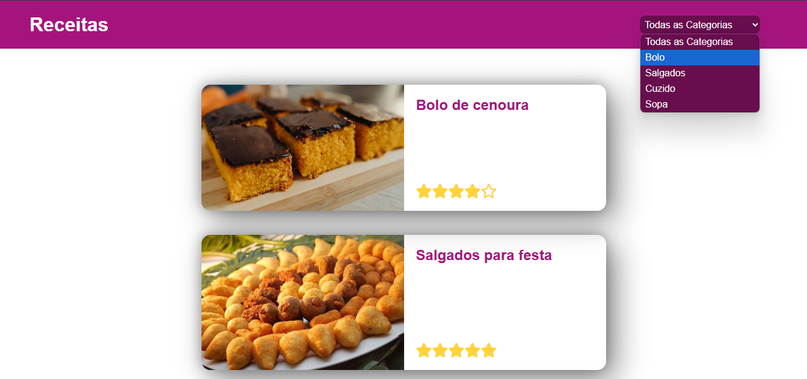
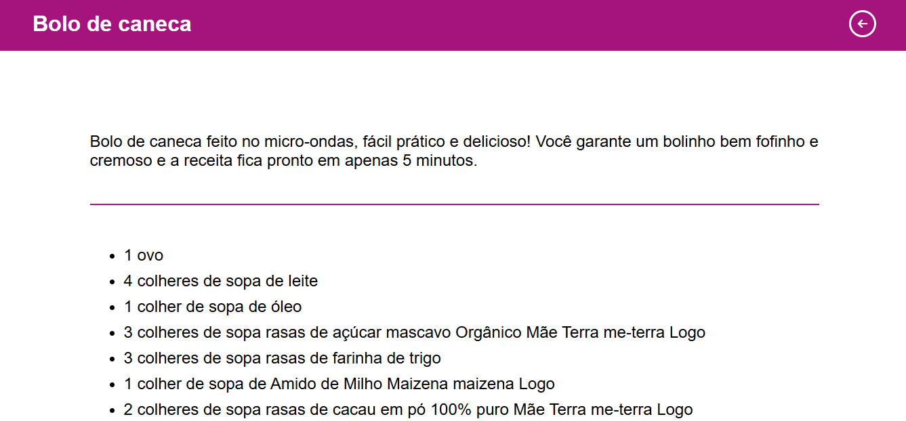

<h1 align="center">Web Site de Reseitas</h1>

<p></p>



<br/>
<h2>🎲 Tipo de dados que api  retorna</h2>


<p>🚀 http://localhost:3333/recipes</p>

```typescript
type Recipes = [{
  "id": number,
  "title": string,
  "description": string,
  "clue": string,
  "img": string,
  "ingredients": [string,string,string],
  "preparation": [string,string,string],
  "category": string,
  "stars": string
}]
```
<p>🚀 http://localhost:3333/category</p>

```typescript
type Category = [string]
``` 
<br/>

## 💻 &nbsp;Tecnologias usadas no projeto

&nbsp;
&nbsp;
&nbsp;

> **Nota:** Os testes podem ser realizados sem depender de uma API.